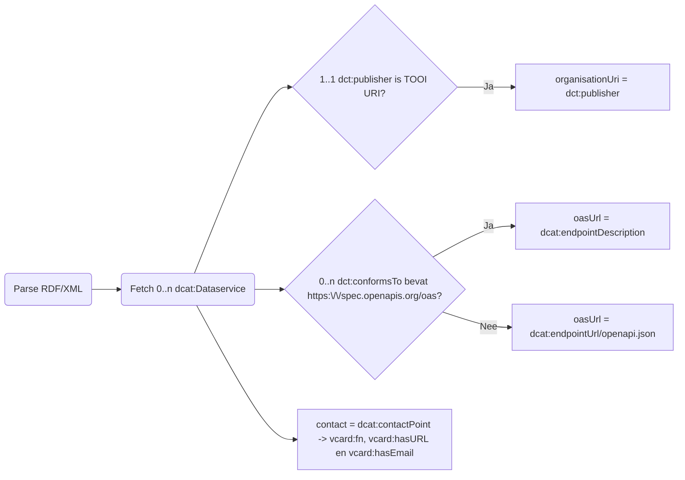

# DCAT-AP-NL 3.0 naar API-register

## Voorwaarden vanuit [DCAT-AP-NL 3.0](https://docs.geostandaarden.nl/dcat/dcat-ap-nl30/)

- `dct:publisher` is verplicht
- `dcat:endpointDescription` is verplicht
- `dcat:contactPoint` is verplicht
- `dcat:contactPoint` moet een `vcard` zijn

## Voorwaarden vanuit API-register

- `dct:publisher` **MOET** een TOOI identifier zijn (bijv. `https://identifier.overheid.nl/tooi/id/gemeente/gm0344`)
- Als `dcat:endpointDescription` een verwijzing is naar de bijbehorende OAS, dan **MOET** `dct:conformsTo` een verwijzing naar `https://spec.openapis.org/oas` bevatten
- Als `dct:conformsTo` geen verwijzing naar `https://spec.openapis.org/oas` bevat, dan **MOET** de bijbehorende OAS resolvable zijn op `dcat:endpointUrl/openapi.json` ([ADR](https://developer.overheid.nl/kennisbank/apis/api-design-rules/cheat-sheet#gebruik-openapi-specification))
- `dcat:contactPoint` **MOET** `vcard:fn`, `vcard:hasURL` en `vcard:hasEmail` bevatten ([ADR](https://developer.overheid.nl/kennisbank/apis/api-design-rules/cheat-sheet#contactinformatie))
- Indien er geen meerdere talen voor `vcard:fn` zijn wordt de enige beschikbare genomen
- Indien er meerdere talen voor `vcard:fn` zijn, wordt de Nederlandse vertaling genomen

## Proces

